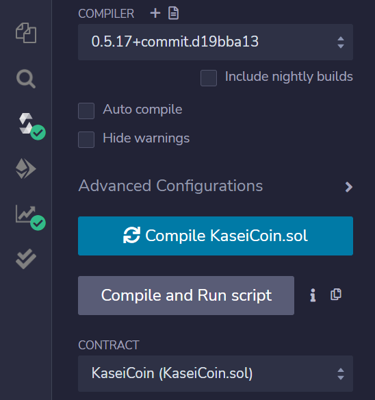
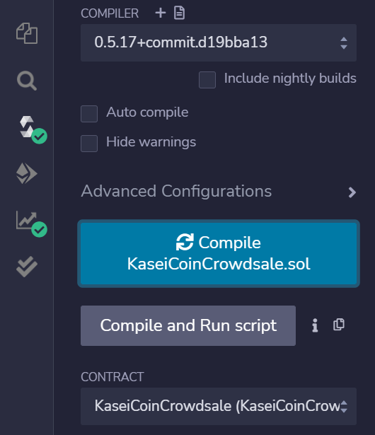
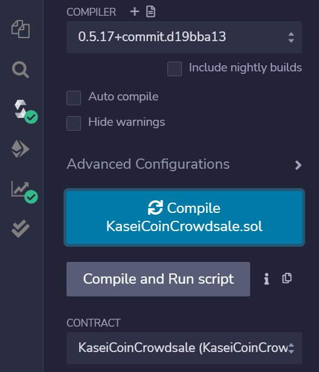
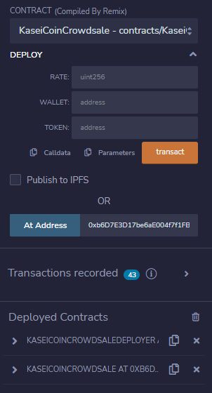
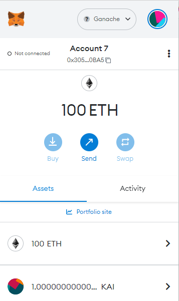
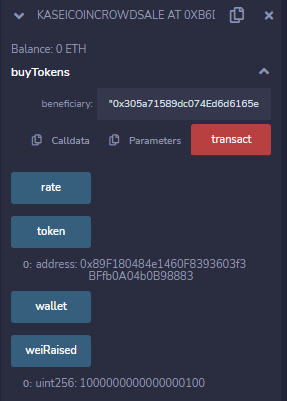

# Martian_Token_Crowdsale

Launching a crowdsale that allows people who are moving to Mars to convert their Earthling money to KaseiCoin.

## Technologies Required

The 2 Solidity files can be deployed on Remix with the use of Ganache blockchain enironment and a MetaMask wallet. 

## Evaluation Evidence

Successful compilation of the KaseiCoin contract:

Successful compilation of the KaseiCoinCrowdsale contract:

Successful compilation of the KaseiCoinCrowdsale contract with Deployer:

Successful deployment of the KaseiCoinCrowdsale contract with Deployer:

Successful purchase of KAI token using MetaMask and Ganche:

Wei Raised reflects the tokens sold at crowdsale:

## Contributors

Owen Harris.